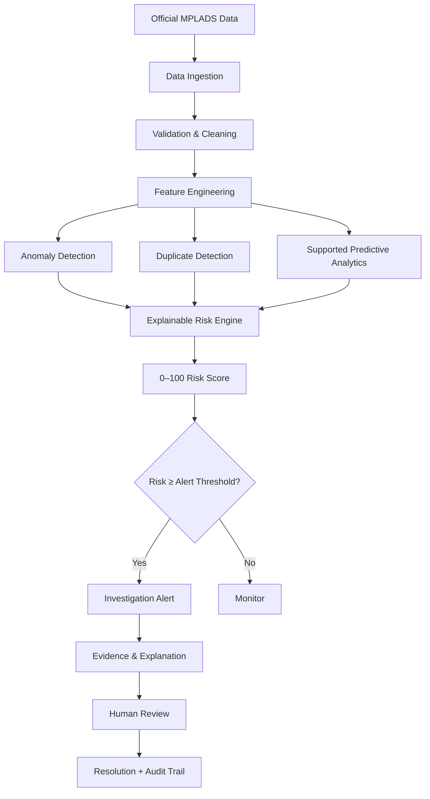
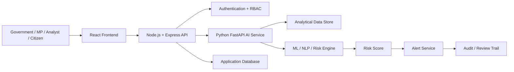
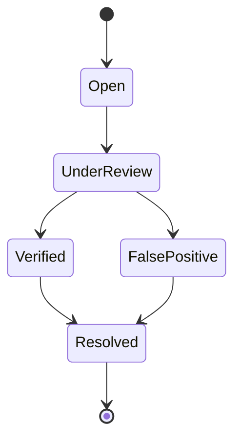

<div align="center">


# SAHAYA
### AI-Powered MPLADS Risk & Monitoring Platform

**Smart India Hackathon 2026 · SIH26102 · Smart Automation · Software**

<p>
  
  
  
  
</p>

**Detect → Explain → Prioritize → Investigate**

[Problem Statement](#-problem-statement) ·
[Solution](#-solution) ·
[AI Engine](#-ai-risk-engine) ·
[Architecture](#-system-architecture) ·
[Demo](#-demo-flow) ·
[Setup](#-getting-started) ·
[SIH Submission](#-sih-round-2-submission-alignment)

</div>

---

## 🎯 Problem Statement

> **SIH26102 — Development of an AI-powered system to detect anomalies, fraud, and inefficiencies in MP-LAD Scheme implementation**

### The challenge

MPLADS monitoring involves large and heterogeneous records covering works, expenditure, implementing districts, vendors, MPs and project status. Manual scrutiny makes it difficult to consistently prioritise which records deserve deeper investigation.

SAHAYA is designed as an **AI-assisted monitoring and risk-prioritisation platform** that helps authorised users:

- detect unusual expenditure and project patterns
- identify potential duplicate or highly similar works
- surface unusual vendor/payment concentration
- identify delayed/open works
- identify unusual fund-utilisation behaviour
- highlight source-data quality issues
- rank projects using an explainable **0–100 risk score**
- generate alerts and recommended investigation actions
- maintain a human-review and audit workflow

> ⚠️ **Responsible-AI position:** SAHAYA does **not** declare a project, person, vendor or organisation fraudulent. It detects anomalous patterns and produces risk indicators for authorised human investigation.

---

## 🚀 Why SAHAYA?

| Traditional Monitoring | SAHAYA |
|---|---|
| Manual first-pass scrutiny | Automated screening |
| Reactive investigation | Proactive risk prioritisation |
| Isolated records | Cross-record comparison |
| Difficult prioritisation | 0–100 risk ranking |
| Black-box flags | Explainable risk components |
| Separate analytical views | Integrated monitoring dashboard |
| Investigation without structured workflow | Alert → Review → Resolution → Audit |

### Core value proposition

**SAHAYA converts large-scale MPLADS data into explainable risk intelligence so that officials can focus their limited investigation time on the records most deserving of attention.**

---

## 🧠 Solution Overview



---

# 🤖 AI Risk Engine

SAHAYA is not dependent on a single model.

The analytical layer combines multiple complementary signals:

| Method | Purpose |
|---|---|
| **Robust Statistics** | Detect unusual values using median/MAD/IQR-style methods |
| **Isolation Forest** | Multivariate unsupervised anomaly detection |
| **Local Outlier Factor** | Detect local-density anomalies |
| **DBSCAN** | Identify clusters and noise/outlier points |
| **Auditable Rules** | Transparent domain-specific checks |
| **TF-IDF + Cosine Similarity** | Detect potentially duplicate/similar work descriptions |

### Why unsupervised learning?

A reliable labelled dataset of confirmed MPLADS fraud cases is not available for training the primary anomaly detector.

Therefore, SAHAYA focuses on:

> **Anomaly detection + explainable domain evidence + human investigation**

rather than pretending that an anomaly classifier can directly prove fraud.

---

# 📊 Six-Component Explainable Risk Engine

SAHAYA converts multiple signals into a single **0–100 risk indicator** while retaining the component-level evidence.

| Risk Component | Weight | What it represents |
|---|---:|---|
| 💰 Cost Risk | **24%** | Unusual cost relative to comparable works |
| 📋 Duplicate Risk | **22%** | Potentially duplicated/highly similar works |
| 🏢 Vendor Risk | **20%** | Unusual vendor/payment concentration |
| ⏱️ Delay Risk | **14%** | Unusually long/open execution |
| 💵 Utilisation Risk | **12%** | Unusual fund-utilisation behaviour |
| 🧹 Data Quality Risk | **8%** | Missing/inconsistent source information |

### Risk bands

```text
0 ───────── 24     LOW
25 ──────── 49     MODERATE
50 ──────── 74     HIGH
75 ─────── 100     CRITICAL
```

### Alert threshold

```text
Risk Score ≥ 60
        ↓
Investigation Alert
```

The final score is designed to preserve strong individual risk signals while using corroborating anomaly evidence.

---

# 🔎 Duplicate Work Detection

```text
Work Description
       ↓
Text Normalisation
       ↓
Character N-Grams
       ↓
TF-IDF Vectorisation
       ↓
Cosine Similarity
       ↓
Similarity Threshold
       ↓
Potential Duplicate
       ↓
Human Review
```

Current configuration includes:

- Character n-grams: **3–5**
- Near-duplicate similarity threshold: **0.85**
- Exact-duplicate threshold: **0.995**

Character n-grams help tolerate small spelling, abbreviation and wording variations.

> Similarity is an **investigation signal**, not proof of fraudulent duplication.

---

# 📈 Data Foundation

The current analytical documentation reports:

| Dataset / Dimension | Records / Coverage |
|---|---:|
| Recommended works | **83,621** |
| Completed works | **43,173** |
| Expenditure records | **106,263** |
| MP summary | **764** |
| States / UTs | **36** |
| Implementing districts | **772** |
| Vendors | **26,491** |
| Documented coverage | **2023-06-14 → 2026-08-21** |

### Data quality

Documented project-level data-quality results include:

- **100% validity**
- **97.92% completeness**
- **86.34% uniqueness**
- **96.06% overall quality**

The pipeline is designed to preserve source snapshots, validation results, dataset/version information and analytical lineage.

### Important data limitation

Some source datasets do not provide strong identifiers for direct record-level joins.

Therefore, SAHAYA avoids inventing unsupported relationships and uses supported aggregation levels where necessary.

---

# 🏗️ System Architecture



### Major layers

**Frontend**
- React
- Vite
- Tailwind CSS
- React Router
- Recharts

**Application backend**
- Node.js
- Express
- JWT-based authentication
- MongoDB/Mongoose where used by the application layer

**AI/analytics service**
- Python
- FastAPI
- Pandas
- NumPy
- Scikit-learn
- SQLAlchemy
- ML/NLP pipeline

---

# 🔐 Security & Governance

The analytics service is designed around controlled access and traceability.

Key controls include:

- Role-based access
- API authentication
- Rate limiting
- Audit logging
- SQL parameterisation/guarding
- Controlled analytics queries
- Human-in-the-loop review
- Model/feature/run version tracking
- Environment-based configuration

### Governance principle

```text
AI Flag
  ↓
Evidence
  ↓
Human Review
  ↓
Decision
  ↓
Audit Trail
```

**AI prioritises. Humans decide.**

---

# 🚨 Alert Workflow



Every alert should answer:

1. **What was flagged?**
2. **Why was it flagged?**
3. **Which risk components contributed?**
4. **What evidence supports the signal?**
5. **What should the officer check?**
6. **What was the final review outcome?**

---

# 🧾 Example Investigation View

A high-risk project should expose:

```text
┌──────────────────────────────────────────────┐
│ PROJECT RISK                                 │
│                                              │
│ Risk Score: 72 / 100                        │
│ Risk Band : HIGH                            │
│                                              │
│ Cost Risk          ████████████  81          │
│ Duplicate Risk     ███████████  73          │
│ Vendor Risk        ██████       42          │
│ Delay Risk          █████████    65          │
│ Utilisation Risk    ███          28          │
│ Data Quality        █            10          │
│                                              │
│ WHY FLAGGED?                                 │
│ • Cost deviation from comparable works      │
│ • High text similarity with another work    │
│ • Unusual execution duration                 │
│                                              │
│ RECOMMENDED REVIEW                           │
│ ✓ Sanction records                           │
│ ✓ Measurement book                           │
│ ✓ Payment vouchers                           │
│ ✓ Implementing agency records                │
└──────────────────────────────────────────────┘
```

---

# 🖥️ Product Modules

### 🏛️ Government Dashboard

- Total works
- Expenditure
- Risk distribution
- High-risk/critical works
- State/district insights
- Trend analysis

### 📋 Risk Register

- Project
- Location
- Amount
- Risk score
- Risk band
- Primary risk reason
- Review status

### 🔍 Project Details

- Component-level risk
- Evidence
- Comparable works
- Duplicate candidates
- Recommended action

### 🚨 Alerts

- Open
- Under Review
- Verified
- False Positive
- Resolved

### 🗺️ Regional Analytics

- State/district risk distribution
- Geographic drill-down
- Regional trends

---

# ⚡ Live Scoring

SAHAYA is designed to support scoring of a new work against an existing reference population.

```text
New Work
   ↓
Feature Extraction
   ↓
Reference Population
   ↓
Anomaly + Similarity Analysis
   ↓
Risk Engine
   ↓
0–100 Risk Score
   ↓
Explanation + Recommended Action
```

This enables a potential **pre-screening / early-warning workflow** for newly proposed or updated records where the required source features are available.

---

# 🧪 Model Evaluation Strategy

Because the core anomaly system is unsupervised, evaluation must not rely on a meaningless generic accuracy percentage.

### Anomaly detection

Evaluate:

- Planted-anomaly detection
- Expert-reviewed samples
- Precision@K where labels exist
- Score stability
- False-positive analysis

### Duplicate detection

Create a labelled benchmark and report:

- Precision
- Recall
- F1-score
- False-positive rate

### Risk engine

Evaluate:

- Ranking quality
- Score stability
- Component contribution
- Threshold sensitivity
- Reviewer usefulness

### Data pipeline

Measure:

- Validity
- Completeness
- Uniqueness
- Consistency
- Coverage

---

# 📌 SIH Round 2 Positioning

## Problem

Large-scale MPLADS monitoring requires systematic identification of unusual, delayed, duplicated, financially abnormal or low-quality records.

## Solution

SAHAYA provides an integrated AI-assisted monitoring platform that:

1. ingests and validates MPLADS data
2. engineers analytical features
3. detects multiple types of anomalies
4. identifies potentially similar/duplicate works
5. calculates six explainable risk components
6. produces a 0–100 risk indicator
7. prioritises high-risk records
8. provides evidence and recommended checks
9. supports human investigation
10. maintains an alert/review trail

## Innovation

### 1. Multi-signal risk intelligence

Combines statistical, ML, NLP and rule-based evidence.

### 2. Explainable risk scoring

The score is decomposed into understandable risk components.

### 3. Human-in-the-loop governance

The system prioritises investigation rather than making autonomous accusations.

### 4. Duplicate detection

Uses textual similarity to identify potentially repeated works.

### 5. Action-oriented output

The system goes beyond “anomaly detected” and provides evidence and recommended checks.

---

# 🌍 Expected Impact

| Impact Area | Expected Benefit |
|---|---|
| Anomaly Detection | Faster identification of unusual patterns |
| Risk Prioritisation | Focus manual scrutiny on high-risk records |
| Financial Transparency | Better visibility into expenditure/utilisation |
| Duplicate Detection | Surface potentially repeated/similar works |
| Project Monitoring | Identify delayed/open projects |
| Explainable AI | Make risk signals understandable |
| Data Quality | Surface missing/inconsistent source information |
| Governance | Support proactive, evidence-based review |

---

# ⚠️ Known Limitations

SAHAYA should explicitly acknowledge:

- Public data may contain missing/inconsistent fields.
- Confirmed fraud labels are limited.
- Some datasets cannot be reliably joined at work level.
- Text similarity can produce false positives.
- Anomaly detection identifies unusual behaviour, not criminal intent.
- Thresholds require calibration and periodic review.
- Model drift may occur as data patterns change.
- Final administrative decisions remain with authorised officials.

Acknowledging limitations increases technical credibility.

---

# 🛠️ Tech Stack

| Layer | Technologies |
|---|---|
| Frontend | React, Vite, Tailwind CSS, React Router, Recharts |
| Backend | Node.js, Express |
| Authentication | JWT / RBAC |
| Application DB | MongoDB / Mongoose |
| AI API | Python, FastAPI |
| Data/ML | Pandas, NumPy, Scikit-learn |
| Similarity | TF-IDF, Cosine Similarity |
| Analytics DB | SQLAlchemy + supported SQL storage |
| Testing | Node/Python test suites |
| Deployment | Container-ready architecture |

---

# 📁 Repository Structure

```text
SIH2026/
│
├── frontend/                 # React application
│
├── backend/                  # Node.js / Express backend
│
├── AiModel by claude/        # AI / analytics service
│   └── mplads-ai-monitor/
│       ├── anomaly_detection/
│       ├── risk_engine/
│       ├── backend/
│       ├── config/
│       ├── data/
│       └── requirements.txt
│
├── data/                     # Project data/resources
├── Model/                    # Model-related resources
├── models/                   # Model artifacts/resources
├── test/                     # Tests
│
├── test_full_flow.js
├── test_frontend_flow.js
├── test_login.js
└── package.json
```

---

# 🚀 Getting Started

> **Note:** Keep the commands below synchronized with the actual repository startup scripts before Round 2. Do not publish commands that have not been tested on a clean machine.

### 1. Clone

```bash
git clone https://github.com/AKSHAT2801-PRO/SIH2026.git
cd SIH2026
```

### 2. Install application dependencies

```bash
npm install
```

### 3. Install frontend dependencies

```bash
cd frontend
npm install
cd ..
```

### 4. Install AI service dependencies

```bash
cd "AiModel by claude/mplads-ai-monitor"
pip install -r requirements.txt
cd ../..
```

### 5. Configure environment

Create the required `.env` files from the project's environment templates.

**Never commit production secrets, API keys or database passwords.**

### 6. Start the services

Run the frontend, Node/Express backend and Python/FastAPI service according to the current project scripts/configuration.

### 7. Verify

Check:

```text
Frontend
   ↓
Backend API
   ↓
AI API
   ↓
Database
   ↓
Risk scoring
   ↓
Dashboard
```

---

# 🧪 Testing

Before every SIH demo:

```text
✓ Login
✓ Registration
✓ Dashboard
✓ API connectivity
✓ Risk scoring
✓ Duplicate detection
✓ Alerts
✓ Review workflow
✓ Database
✓ AI service
✓ Frontend routing
✓ No hard-coded production secrets
```

Run the repository's available test scripts and confirm the complete flow on a clean environment.

---

# 🎥 Recommended SIH Demo Flow

### 01 — Government Dashboard

Show:

> “This is the monitoring overview.”

### 02 — High-Risk Project

Open a flagged project.

### 03 — Explainability

Show:

> Cost + Duplicate + Delay + Vendor + Utilisation + Data Quality

### 04 — Evidence

Show comparable works and duplicate candidates.

### 05 — Recommended Action

Show what the officer should verify.

### 06 — Human Review

Move alert to:

> **UNDER REVIEW**

### 07 — Audit

Show the review history.

### 08 — Optional Live Score

Submit a new work and generate its risk indicator.

---

# 🏆 SIH Round 2 Readiness Checklist

## Presentation

- [ ] Problem clearly explained
- [ ] Solution architecture shown
- [ ] Actual data statistics included
- [ ] AI methodology explained
- [ ] Six risk components explained
- [ ] Risk calculation explained
- [ ] Evaluation results included
- [ ] Real risk case shown
- [ ] Dashboard screenshots included
- [ ] Human-in-the-loop shown
- [ ] Security explained
- [ ] Scalability explained
- [ ] Limitations acknowledged

## Product

- [ ] Frontend stable
- [ ] Backend stable
- [ ] AI service stable
- [ ] Database stable
- [ ] Authentication working
- [ ] RBAC working
- [ ] Risk register working
- [ ] Project details working
- [ ] Explainability working
- [ ] Duplicate detection working
- [ ] Alerts working
- [ ] Audit trail working
- [ ] Live scoring tested
- [ ] Backup demo available

## ML

- [ ] Dataset documented
- [ ] Data quality measured
- [ ] Features documented
- [ ] Anomaly validation performed
- [ ] Duplicate benchmark created
- [ ] False-positive analysis performed
- [ ] Thresholds justified
- [ ] Model versions tracked
- [ ] Results reproducible

---

# 🧑‍⚖️ Judge Questions We Are Prepared For

### Why AI?

Large-scale heterogeneous records require automated screening and prioritisation beyond manual scrutiny and simple thresholds.

### Why unsupervised learning?

Reliable confirmed-fraud labels are not available for the primary problem, so the system detects unusual patterns instead of pretending to classify fraud.

### Does SAHAYA detect fraud?

**No.** It identifies anomalous/risky patterns and provides evidence for authorised human investigation.

### Why Isolation Forest?

It is suitable for multivariate unsupervised anomaly detection and can identify rare observations efficiently.

### Why multiple models?

Different detectors identify different forms of unusual behaviour. Combining signals can provide stronger and more explainable evidence than relying on one model.

### How do you control false positives?

Peer comparison, multiple signals, configurable thresholds, explainability and human review.

### Can it scale?

The architecture separates frontend, application APIs and analytics services and can be extended with batch processing, database indexing, cached text representations, persisted model artifacts, PostgreSQL and containerised deployment.

---

# 🔭 Future Scope

- Automated data ingestion from official sources where supported
- Temporal anomaly detection
- Better geospatial risk analysis
- Advanced semantic duplicate detection
- Model drift monitoring
- Reviewer feedback loops
- Explainable predictive models
- Multi-scheme expansion beyond MPLADS
- Cloud-scale batch processing
- Controlled integration with government workflows

---

# 📜 SIH Submission Alignment

### Problem Statement

**SIH26102**

### Problem Statement Title

**Development of an AI-powered system to detect anomalies, fraud, and inefficiencies in MP-LAD Scheme implementation**

### Theme

**Smart Automation**

### Category

**Software**

### Idea Title

**SAHAYA — AI-Powered MPLADS Risk & Monitoring Platform**

### One-line solution description

> **An explainable AI-powered monitoring platform that analyses MPLADS data to detect anomalous patterns, identify potential duplicate works, prioritise project risks and provide evidence-driven alerts for human investigation.**

### Short portal-ready description

> **SAHAYA is an AI-assisted MPLADS monitoring and analytics platform designed to identify anomalies, inefficiencies and potential fraud indicators in project execution and fund utilisation. It combines robust statistical analysis, unsupervised anomaly detection, NLP-based duplicate detection, domain rules and an explainable six-component risk engine to generate a 0–100 project risk indicator. High-risk records are prioritised through alerts with supporting evidence, comparable works and recommended investigation checks. Role-based dashboards enable government stakeholders to monitor projects, expenditure, regional patterns and alert status. The system follows a human-in-the-loop approach: AI prioritises suspicious patterns while authorised officials make the final investigation and administrative decisions.**

> **Important:** The README supports the repository and demonstration. It does not replace whatever exact fields, file formats or character limits the live SIH 2026 portal requires.

---

# 📚 References

- Smart India Hackathon — Official Portal
- MPLADS Official Portal
- MPLADS Guidelines
- Open Government Data Platform India
- Scikit-learn documentation
- Research/reference material for anomaly detection and text similarity

---

# 👥 Team Sahaya

**Team:** Sahaya  
**SIH:** Smart India Hackathon 2026  
**PS:** SIH26102

> **Built for transparent, explainable and proactive MPLADS monitoring.**

<div align="center">

### SAHAYA

**Detect → Explain → Prioritize → Investigate**

</div>
